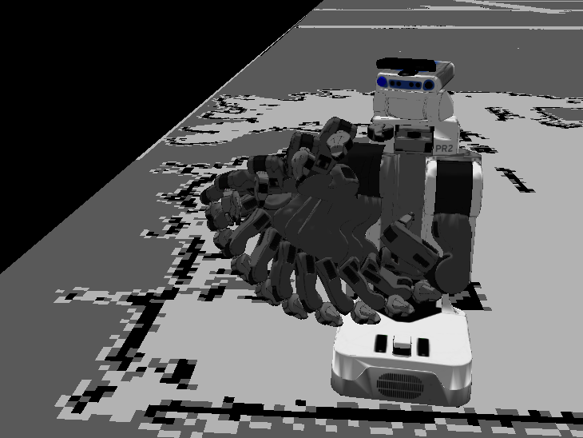

pr2eus_openrave ROS Launch Files
================================

**Description:** pr2eus_openrave

  
  
       pr2eus_openrave
  
    

**License:** BSD

collision_map_publisher.launch
------------------------------

.. code-block:: bash

  roslaunch pr2eus_openrave collision_map_publisher.launch

hironx_openrave_armplan.launch
------------------------------

.. code-block:: bash

  roslaunch pr2eus_openrave hironx_openrave_armplan.launch

hrp4c_openrave_armplan.launch
-----------------------------

.. code-block:: bash

  roslaunch pr2eus_openrave hrp4c_openrave_armplan.launch

openrave_armplan.launch
-----------------------

.. code-block:: bash

  roslaunch pr2eus_openrave openrave_armplan.launch

pr2_openrave_armplan.launch
---------------------------

.. code-block:: bash

  roslaunch pr2eus_openrave pr2_openrave_armplan.launch

This launch file is expected to be used inside Local PC.
If you launch this inside PR2, set armplanning_option "--viewer=''".

- A Node: armplanning_openrave.py is used to bridge Openrave and ROS.

  

Contents
########

.. code-block:: xml

  <launch>
    <arg default="" name="armplanning_option" />
    <node args="--collision_map=/collision_map_mux --mapframe=''        --wait-for-collisionmap=30        --request-for-joint_states='service'        $(arg armplanning_option)" name="pr2eus_openrave_armplan" output="screen" pkg="orrosplanning" type="armplanning_openrave.py" />
    <node args="collision_map_mux collision_map_none collision_map_occ" name="mux_for_colmap" output="screen" pkg="topic_tools" type="mux">
      <remap from="mux" to="collision_map_mux" />
    </node>
  </launch>

pr2_openrave_simulation.launch
------------------------------

.. code-block:: bash

  roslaunch pr2eus_openrave pr2_openrave_simulation.launch

  This launch file is used for simulation.

  Please check test/test_pr2_openrave_simulation.launch
  

Contents
########

.. code-block:: xml

  <launch>
    <param name="robot_description" textfile="$(find pr2_mechanism_model)/pr2.urdf" />
    <node name="robot_state_publisher" pkg="robot_state_publisher" type="state_publisher" />
    <arg default="1" name="COLLISION_MAP_WAIT_TIME" />
    <node args="--request-for-joint_states='topic'        --collision_map=/collision_map_occ_throttle        --wait-for-collisionmap=$(arg COLLISION_MAP_WAIT_TIME) --use-simulation='true'" name="armplanning_openrave" output="screen" pkg="orrosplanning" type="armplanning_openrave.py" />
    
  </launch>

test_hironx_openrave_simulation.launch
--------------------------------------

.. code-block:: bash

  roslaunch pr2eus_openrave test_hironx_openrave_simulation.launch

roseus + openrave example for Kawada Hiro Robot

.. video:: http://jenkins.jsk.imi.i.u-tokyo.ac.jp:8080//job/jsk-ros-pkg-fuerte/lastSuccessfulBuild/artifact/doc/pr2eus_openrave/html/_images/rviz_hironx_openrave
  :width: 400

  

Contents
########

.. code-block:: xml

  <launch>
    <include file="$(find pr2eus_openrave)/launch/hironx_openrave_armplan.launch">
      <arg name="test" value="true" />
    </include>
  
    </launch>

test_hrp4c_openrave_simulation.launch
-------------------------------------

.. code-block:: bash

  roslaunch pr2eus_openrave test_hrp4c_openrave_simulation.launch

test_pr2_openrave_simulation.launch
-----------------------------------

.. code-block:: bash

  roslaunch pr2eus_openrave test_pr2_openrave_simulation.launch

roseus + openrave example.

.. video:: http://jenkins.jsk.imi.i.u-tokyo.ac.jp:8080//job/jsk-ros-pkg-fuerte/lastSuccessfulBuild/artifact/doc/pr2eus_openrave/html/_images/rviz_pr2_openrave
  :width: 400

  

Contents
########

.. code-block:: xml

  <launch>
    <include file="$(find pr2eus_openrave)/launch/pr2_openrave_simulation.launch">
      <arg name="COLLISION_MAP_WAIT_TIME" value="20" />
    </include>
    <node args="-sync -d $(find pr2eus_openrave)/test/test_pr2eus_openrave.vcg" launch-prefix="glc-capture --start --out=$(find pr2eus_openrave)/build/rviz_pr2_openrave.glc" name="rviz_pr2_openrave" pkg="rviz" type="rviz" />
  
    <test args="$(find pr2eus_openrave)/test/pr2_openrave_simulation.l" name="pr2eus_openrave_eus" pkg="roseus" test-name="pr2_openrave_simulation" time-limit="3000" type="roseus" />
    
    <test args="$(find pr2eus_openrave)/build/rviz_pr2_openrave.glc" pkg="jsk_tools" test-name="z_pr2_openrave_encode" time-limit="3000" type="glc_encode.sh" />
    <param name="use_sim_time" value="true" />
    <node args="$(find pr2eus_openrave)/test/collision_map.bag --clock -d 5" name="rosbag_play_collision_map" pkg="rosbag" type="play" />
    <node args="0.130 0.016 1.338 -1.977 0.000 -1.487 /base_link /openni_rgb_optical_frame 100" name="base_to_kinect" pkg="tf" type="static_transform_publisher" />
  
    
  </launch>

